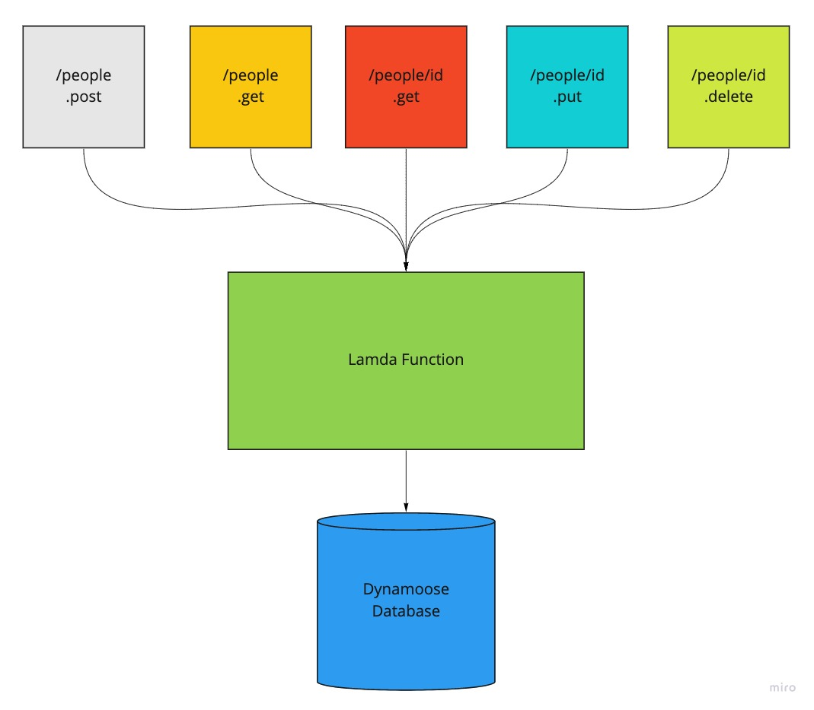

# aws-serverless-api

# AWS: API, Dynamo and Lambda

## LAB - 18

## Create a serverless REST API

Create a single resource REST API using a domain model of your choosing, constructed using AWS Cloud Services

- Database: DynamoDB
  - 1 Table required
- Routing: API Gateway
  - POST
    - /people - Given a JSON body, inserts a record into the database
    - returns an object representing one record, by its id (##)
  - GET
    - /people - returns an array of objects representing the records in the database
    - /people/## - returns an object representing one record, by its id (##)
  - PUT
    - /people/## - Given a JSON body and an ID (##), updates a record in the database
    - returns an object representing one record, by its id (##)
  - DELETE
    - /people/## - Given an id (##) removes the matching record from the database
    - returns an empty object
- CRUD Operation Handlers: Lambda Functions

### Author: Mark Thanadabouth

### Collaborators: Jeremy B, Alex W

#### Links and Resources
* [Dynamoose Docs](https://dynamoosejs.com/guide/Model/#modelupdatekey-updateobj-settings-callback)

### Setup

#### Running App
- How to deploy.
  - In Amazon API Gateway app page, click `Actions` next to resources. Then click `Deploy API` near the bottom of the list.
- What is the root URL to your API?
  - [Deployed Link](https://dlm6j6ncwh.execute-api.us-east-2.amazonaws.com/Main)
- What are the routes?
  - / - "message": "Missing Authentication Token"
  - /people
  - /people/id
- What inputs do they require?
  - Name
- What output do they return?
  - (post) /people - create a name
  - (get) /people - all names
  - (get) /people/id - id specific name
  - (put) /people/id - updates name w/ given id
  - (delete) /people/id - deletes name w/ given id

### UML
<!-- >  -->

### Reflections and Comments
Didn't have to much trouble with this lab. Just a lot of reading the doc for Dynamoose.
